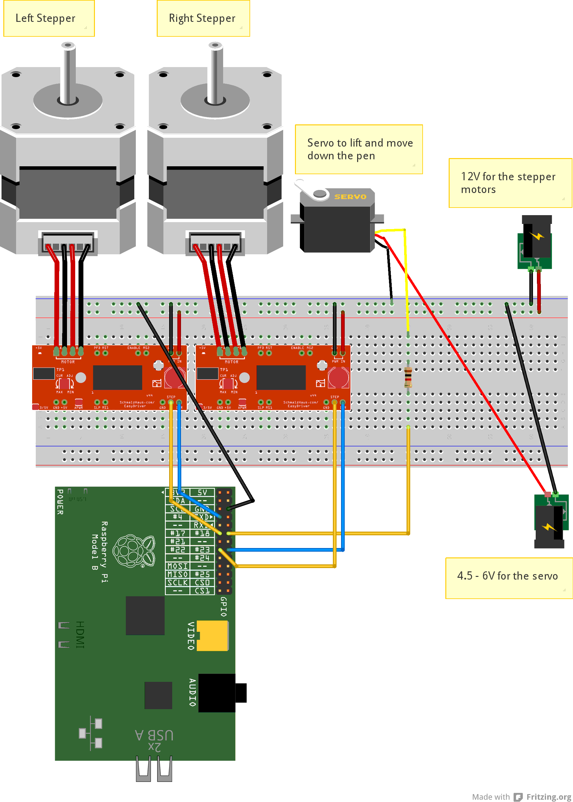

# About #

Vplotter is a vertical plotter for g-code. It runs on a [Raspberry Pi](https://www.raspberrypi.org/). 
Works with the [gcodetools](https://github.com/cnc-club/gcodetools) extension for [Inkscape](https://inkscape.org).

# Install #

- install raspian: [www.raspberrypi.org/downloads/](https://www.raspberrypi.org/downloads/)
- install git:

        sudo apt-get install git-core

- install wiringPi: [wiringpi.com/download-and-install/](http://wiringpi.com/download-and-install/)
- download and build vplotter:

        git clone https://github.com/bertlr/vplotter.git
        cd vplotter
        make -f Makefile CONF=Release

# Wiring #

The plotter uses EasyDriver for the stepper motors:
[www.schmalzhaus.com/EasyDriver/](http://www.schmalzhaus.com/EasyDriver/)

# Usage #

The vplotter reads g-code files.

The plotter needs some commandline arguments:

- x0      :    horizontal distance from the left stepper motor to the zero point of the canvas in mm. see the image 
- y0      :    vertical distance from the left stepper motor to the zero point of the canvas in mm. see the image
- baselength : the distance between the stepper motors in mm, see the image.
- z_up    :    a value for the servo motor to lift the pen (1 - 100)
- z_down  :    a value for the servo motro to move down the pen (1 - 100)
- steps   :    the count of steps to move the cord at 1mm:
 
    1600 / circumference of the pulley
    
    for microsteps

run the plotter as root:

    sudo dist/Release/GNU-Linux/vplotter --x0=170 --y0=-720 --baselength=685 --z_up=11 --z_down=7 --steps=40.1

provide a g-code file test.ngc:

    sudo dist/Release/GNU-Linux/vplotter --x0=170 --y0=-720 --baselength=685 --z_up=11 --z_down=7 --steps=40.1 < test.ngc

finish the plotter type <kbd>Ctrl</kbd>+<kbd>C</kbd> or type in the konsole:
    
    M30

The Z-axis can only lift or drop the pen. A value >0 lift the pen, and <=0 drop the pen.

    G0 Z0 (move the pen down)
    G0 Z1 (raise the pen up)

It is possible to set a feed for G1 like
    
    G1 X100 F200

but this is not exact.
It supports G2 and G3 for circles with radius:
    
    G2 X10 Y20 R20

or with relative center point coordinates:

    G2 X10 Y0 I5 J10

Change units to inches:

    G20

Change to millimetre:

    G21

